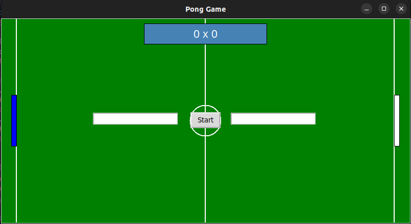
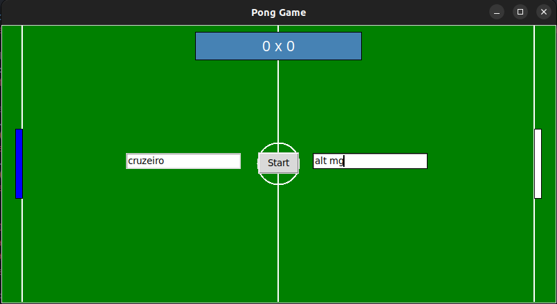
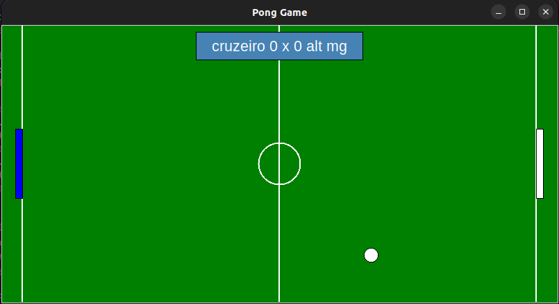
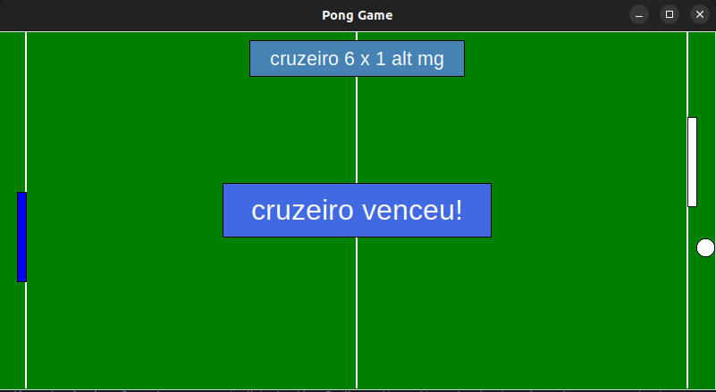

# Pong Game - Campo de Futebol / Soccer Field


## Índice / Table of Contents

1. [English](#english)
2. [Português](#português)


## English

# Pong Game - Soccer Field

This is an adapted version of the classic Pong Game, set on a soccer field, developed in Python using the Tkinter library as part of the final project for Stanford's Code in Place course.

## Table of Contents

1. [Description](#description)
2. [Features](#features)
3. [Requirements](#requirements)
4. [Installation](#installation)
5. [How to Play](#how-to-play)
6. [Code Structure](#code-structure)
7. [Contributions](#contributions)
8. [License](#license)
9. [Contact](#contact)

## Description

Pong Game is a table tennis game for two players where players control paddles to hit the ball. The goal of the game is to score points when the opponent fails to return the ball. The first player to score 6 points wins the game. This version is set on a soccer field.

## Features

- Two players with paddle control.
- Scoring system.
- Collision detection between the ball and paddles.
- Goal detection and ball reset after each point.
- Winner declaration upon reaching 6 points.

### Screenshots

#### Start Screen


#### Setting teams name


#### Gameplay


#### Player Wins


## Requirements

- Python 3.x
- Tkinter (usually included with the standard Python installation)

## Installation

1. Clone this repository:
    ```bash
    git clone https://github.com/righigor/pong-game.git
    ```
2. Navigate to the project directory:
    ```bash
    cd pong-game
    ```
3. Run the game:
    ```bash
    python main.py
    ```

## How to Play

1. Start the game by running the script `main.py`.
2. Enter the names of the players in the input fields and click "Start".
3. Player 1 Controls (blue paddle):
    - `W`: Move up
    - `S`: Move down
4. Player 2 Controls (white paddle):
    - `Up Arrow`: Move up
    - `Down Arrow`: Move down
5. The game ends when one of the players reaches 6 points.

## Code Structure

- `main.py`: Contains all the game logic, including window creation, graphical elements, player controls, ball movement, collision detection, score updating, and game-ending logic.

## Contributions

Contributions are welcome! Feel free to open an issue or submit a pull request.

## License

This project is licensed under the MIT License. See the [LICENSE](LICENSE) file for details.

## Contact

For more information or questions, contact me!

[](mailto:righigordev@gmail.com)
[](https://www.linkedin.com/in/igor-righi/) [](https://twitter.com/righigor) [](https://www.instagram.com/righigor/) [](https://righigordev.netlify.app/)


## Português

# Pong Game - Campo de Futebol

Este é um projeto adaptado do clássico Pong Game, ambientado em um campo de futebol, desenvolvido em Python usando a biblioteca Tkinter como parte do projeto final do curso Code in Place de Stanford.

## Índice

1. [Descrição](#descrição)
2. [Funcionalidades](#funcionalidades)
3. [Requisitos](#requisitos)
4. [Instalação](#instalação)
5. [Como Jogar](#como-jogar)
6. [Estrutura do Código](#estrutura-do-código)
7. [Contribuições](#contribuições)
8. [Licença](#licença)
9. [Contato](#contato)

## Descrição

O Pong Game é um jogo de tênis de mesa para dois jogadores onde os jogadores controlam paddles para acertar a bola. O objetivo do jogo é marcar pontos quando o oponente não consegue rebater a bola. O primeiro jogador a marcar 6 pontos vence o jogo. Esta versão é ambientada em um campo de futebol.

## Funcionalidades

- Dois jogadores com controle de paddles.
- Sistema de pontuação.
- Detecção de colisão entre a bola e os paddles.
- Detecção de gols e reinício da bola após cada ponto.
- Declaração do vencedor após atingir 6 pontos.

### Capturas de Tela

#### Tela Inicial


#### Adicionando nomes dos times


#### Jogo em Andamento


#### Jogador Venceu


## Requisitos

- Python 3.x
- Tkinter (geralmente incluído na instalação padrão do Python)

## Instalação

1. Clone este repositório:
    ```bash
    git clone https://github.com/righigor/pong-game.git
    ```
2. Navegue até o diretório do projeto:
    ```bash
    cd pong-game
    ```
3. Execute o jogo:
    ```bash
    python main.py
    ```

## Como Jogar

1. Inicie o jogo executando o script `main.py`.
2. Insira os nomes dos jogadores nos campos de entrada e clique em "Start".
3. Controles do Jogador 1 (paddle azul):
    - `W`: Mover para cima
    - `S`: Mover para baixo
4. Controles do Jogador 2 (paddle branco):
    - `Seta para cima`: Mover para cima
    - `Seta para baixo`: Mover para baixo
5. O jogo termina quando um dos jogadores atinge 6 pontos.

## Estrutura do Código

- `main.py`: Contém toda a lógica do jogo, incluindo a criação da janela, elementos gráficos, controle dos jogadores, movimentação da bola, detecção de colisões, atualização de pontuação e lógica de término do jogo.

## Contribuições

Contribuições são bem-vindas! Sinta-se à vontade para abrir uma issue ou enviar um pull request.

## Licença

Este projeto está licenciado sob a licença MIT. Veja o arquivo [LICENSE](LICENSE) para mais detalhes.

## Contato

Para mais informações ou dúvidas, entre em contato!

[](mailto:righigordev@gmail.com)
[](https://www.linkedin.com/in/igor-righi/) [](https://twitter.com/righigor) [](https://www.instagram.com/righigor/) [](https://righigordev.netlify.app/)
